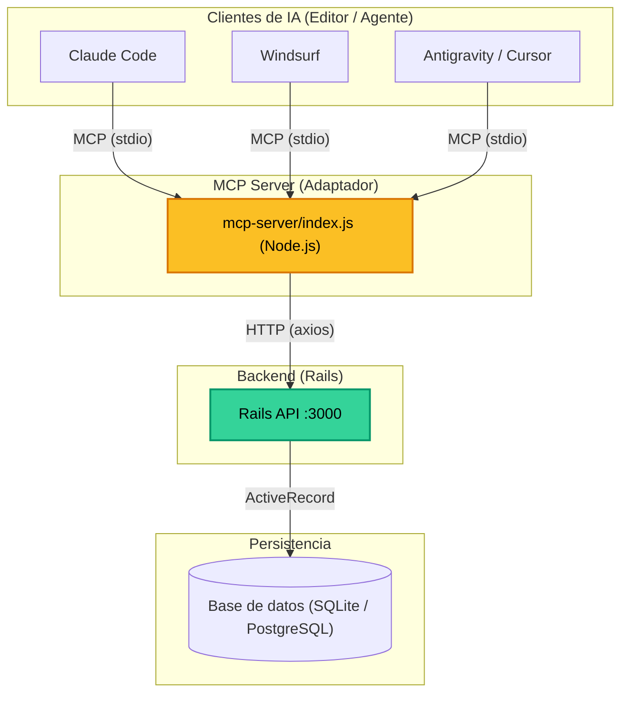

# YTY Rails + MCP Server

## ¿Por qué conectar un backend Rails a herramientas de IA via MCP?

Hoy los editores e IDEs con IA (Claude Code, Windsurf, Cursor) y los agentes autónomos (Antigravity) pueden ejecutar **herramientas** además de solo generar texto. El Model Context Protocol (MCP) es el estándar abierto que define cómo un modelo de IA descubre y llama esas herramientas.

La idea es simple: en lugar de que el desarrollador explique manualmente cómo funciona tu API, **el modelo la opera directamente**. Esto tiene sentido concreto en varios escenarios:

- **Durante el desarrollo**: el agente puede crear datos de prueba, inspeccionar el estado de la base de datos y validar que el CRUD funciona — sin salir del editor.
- **En demos o prototipos**: puedes mostrar tu backend funcionando con lenguaje natural, sin construir un frontend ni usar Postman.
- **Como base para automatización**: este mismo patrón escala a workflows más complejos (pipelines de datos, testing automatizado, administración de contenido).

Lo que este repo demuestra: **un CRUD Rails estándar (Users y Books) expuesto como herramientas MCP**, consumible por cualquier herramienta compatible sin modificar una sola línea del backend.

---

## Arquitectura



El MCP server actúa como adaptador: traduce las llamadas del modelo a requests HTTP contra tu API Rails existente. Rails no sabe nada de MCP; el backend no cambia.

### Estructura de una Herramienta (Tool)

Cada herramienta en el servidor MCP sigue este patrón convencional que permite al LLM entender sus capacidades:

```javascript
server.tool(nombre, descripción, schema, handler);
```

| Componente | Propósito |
| :--- | :--- |
| **Nombre** | Identificador único de la herramienta (ej. `create_user`). |
| **Descripción** | Texto crucial que el LLM lee para decidir cuándo y cómo usar la herramienta. |
| **Schema** | Definición de parámetros (usando `zod`) para validación y tipado. |
| **Handler** | Función `async` que ejecuta la lógica real (ej. llamar a la API de Rails). |

---

## Herramientas disponibles

| Tool             | Descripción                                 |
|------------------|---------------------------------------------|
| `list_users`     | Lista todos los usuarios                    |
| `get_user`       | Obtiene un usuario por ID                   |
| `create_user`    | Crea un usuario con nombre y score          |
| `delete_user`    | Elimina un usuario por ID                   |
| `get_top_users`  | Filtra usuarios con score > 50              |
| `list_books`     | Lista todos los libros                      |
| `get_book`       | Obtiene un libro por ID                     |
| `create_book`    | Crea un libro con título y descripción      |
| `delete_book`    | Elimina un libro por ID                     |

---

## Setup

### Con Docker (recomendado)

```bash
docker-compose up --build
```

Rails y el MCP server se levantan juntos. Las dependencias de Node se instalan automáticamente dentro del contenedor.

### Sin Docker

```bash
rails s
cd mcp-server && npm install
```

---

## Configuración por herramienta

### Claude Code

Crea o edita `.mcp.json` en la raíz del proyecto (aplica solo a este repo) o en `~/.claude/mcp.json` (global):

```json
{
    "mcpServers": {
        "yty-rails": {
            "command": "node",
            "args": ["./mcp-server/index.js"],
            "env": {
                "RAILS_API_URL": "http://localhost:3000"
            }
        }
    }
}
```

Luego reinicia Claude Code o corre `/mcp` para verificar que el server aparece conectado.

### Windsurf

Edita `~/.codeium/windsurf/mcp_config.json`:

```json
{
    "mcpServers": {
        "yty-rails": {
            "command": "node",
            "args": ["/ruta/absoluta/al/proyecto/mcp-server/index.js"],
            "env": {
                "RAILS_API_URL": "http://localhost:3000"
            }
        }
    }
}
```

Windsurf requiere ruta absoluta. Reinicia el editor para que detecte el nuevo server.

### Claude Desktop

Edita `~/.config/claude-desktop/config.json` (Linux) o `~/Library/Application Support/Claude/claude_desktop_config.json` (Mac):

```json
{
    "mcpServers": {
        "yty-rails": {
            "command": "node",
            "args": ["/ruta/absoluta/al/proyecto/mcp-server/index.js"],
            "env": {
                "RAILS_API_URL": "http://localhost:3000"
            }
        }
    }
}
```

Reinicia Claude Desktop. Verás el ícono 🔌 en el chat cuando el server esté activo.

### Antigravity

Antigravity detecta herramientas MCP automáticamente si le pasas la ruta del server. Puedes pedirle directamente:

> "Usa el MCP server en `./mcp-server/index.js` con `RAILS_API_URL=http://localhost:3000` para interactuar con mi app Rails."

O agrégalo a tu configuración global de MCP si tienes una.

---

## Ejemplos de uso

Una vez configurado, prueba pedirle a tu herramienta de IA:

```
"Lista todos los usuarios registrados"
"Crea un usuario llamado Ada Lovelace con score 95"
"¿Qué libros hay en el catálogo?"
"Muéstrame los usuarios destacados (score > 50)"
"Elimina el libro con ID 2"
```

El modelo ejecutará las herramientas directamente contra tu Rails en tiempo real — sin que escribas una sola línea de código adicional.
